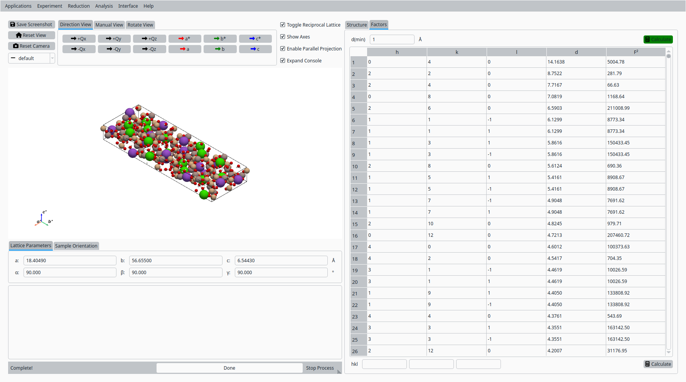

Crystal Structure with Mesolite Data
===================================

This tutorial demonstrates how to use the crystal-structure tools in
*NeuXtalViz* to work with Mesolite data measured on MANDI.

Step 1: Load CIF and view structure
-----------------------------------

In the **Crystal Structure** tool:

- Click **Load CIF**.
- Select the Mesolite CIF for the MANDI dataset.
- The **Structure** tab shows the lattice parameters, space group
  information, unit-cell volume, and a table of atomic positions.
- The 3D view displays the Mesolite framework built from the CIF.

   Mesolite crystal structure loaded from CIF (MANDI).

Step 2: Inspect lattice and scatterers
--------------------------------------

On the **Structure** tab:

- Verify that the lattice constants and angles are reasonable for
  Mesolite.
- Check the chemical formula, Z value, and unit-cell volume.
- Review the list of scatterers (sites, coordinates, occupancies,
  and U values) to understand the crystal chemistry.

Step 3: Calculate F² for reflections
------------------------------------

Switch to the **Factors** tab:

- Enter a minimum d-spacing in the *d(min)* field.
- Click **Calculate** to compute structure factors and :math:`F^2`
  values.
- Use the resulting table of h, k, l, d, and :math:`F^2` to compare
  against other diffraction software or reference results.

   Calculated structure factors :math:`F^2` for Mesolite (MANDI).
