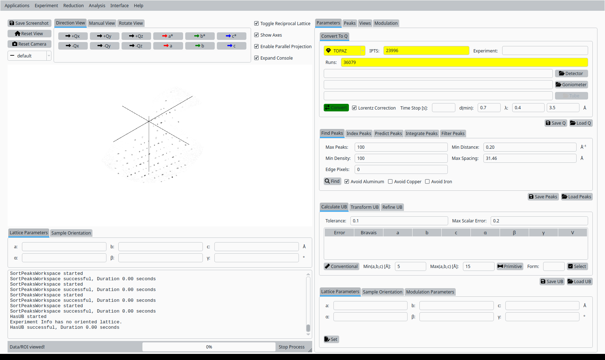
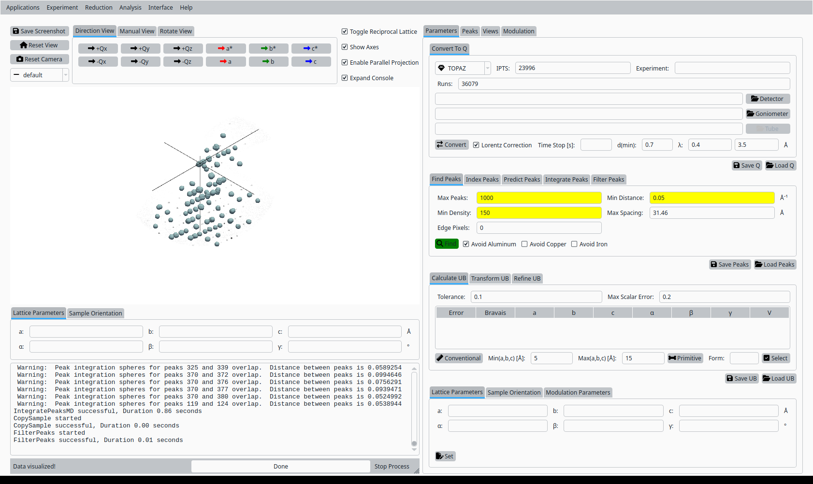
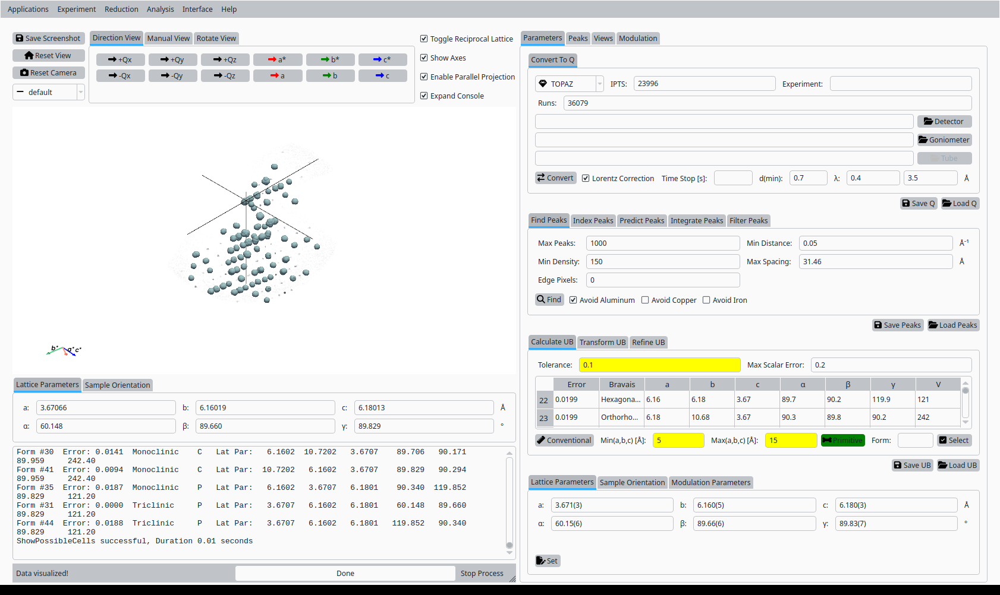
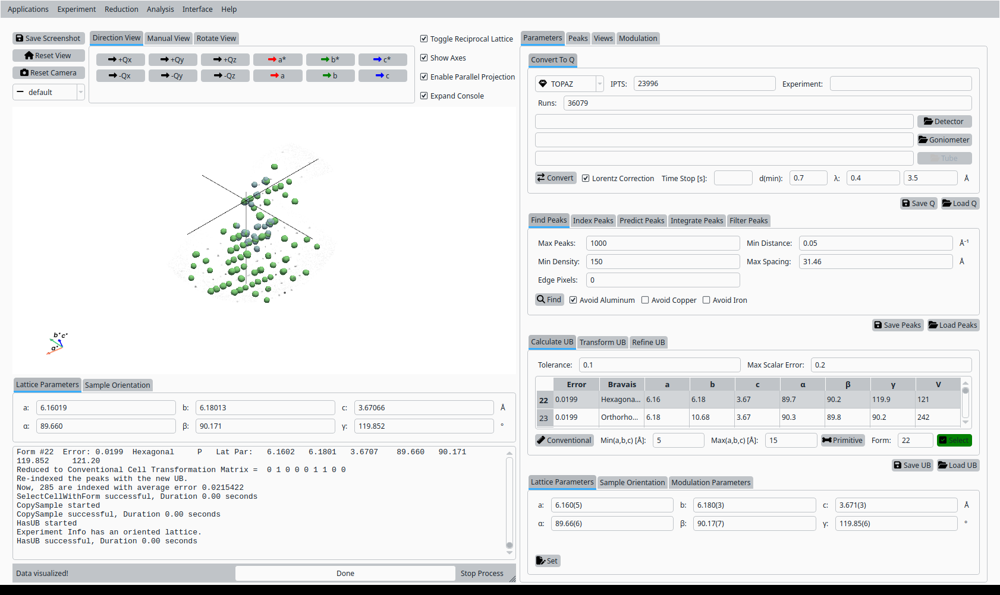
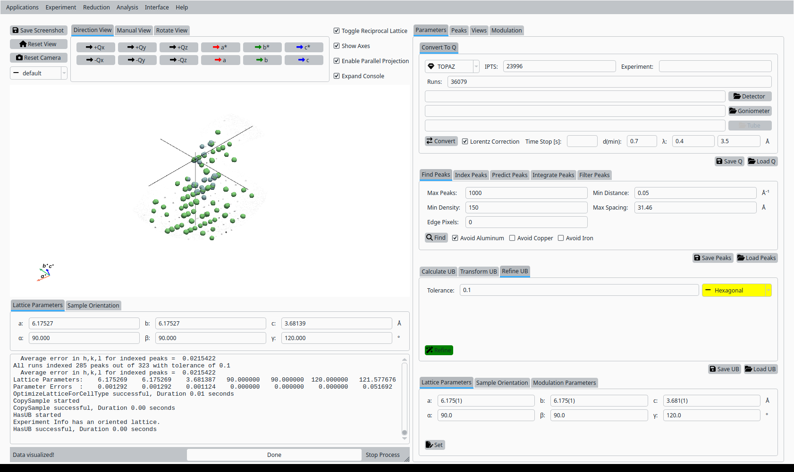
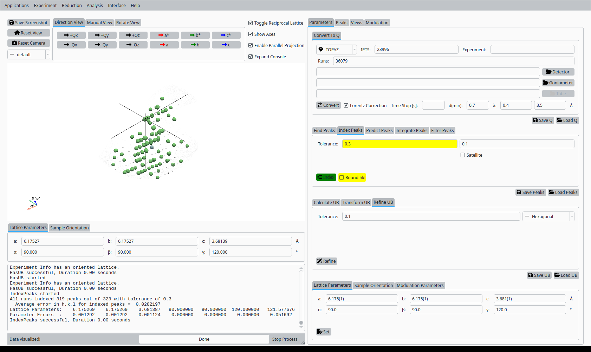
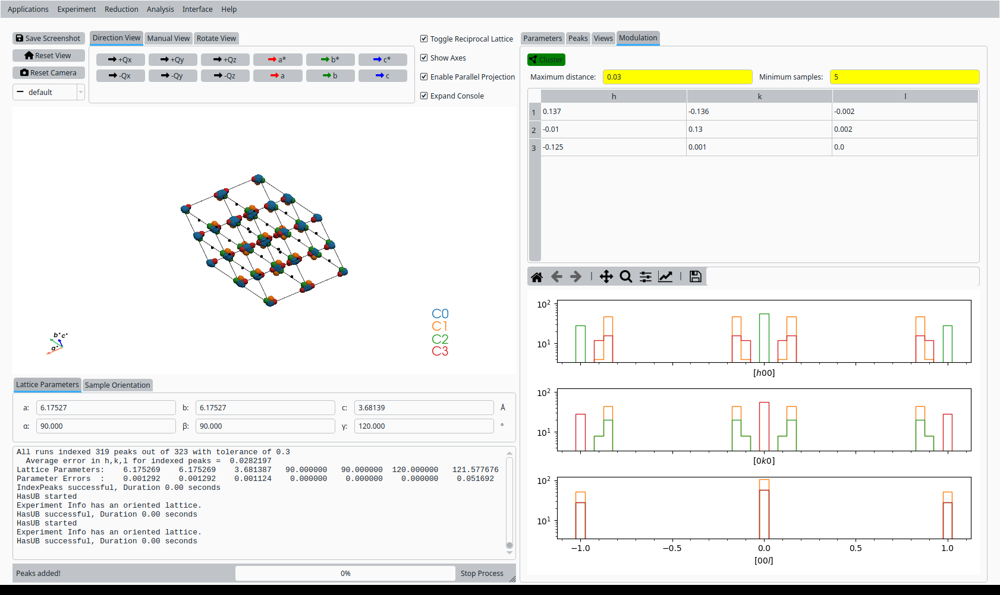

UB Tools with TOPAZ Modulation (MnCoGeAs)
=======================================

This tutorial demonstrates how to use the UB tools in *NeuXtalViz* to
run the TOPAZ modulation scenario for the MnCoGeAs example. The
screenshots were generated by the test script `tests/applications/modulation.py`.

Note: the scenario script is only used to generate the screenshots; it is
not required to be run by documentation readers.

Step 1: Convert to Q
---------------------

In the **Convert to Q** tab:

- Select the **TOPAZ** instrument.
- Enter the IPTS and run numbers used by the scenario (see the test script).
- (Optionally) set wavelength and calibration options as needed.
- Click **Convert to Q** to load the data and build the Q volume.

   Convert MnCoGeAs data to Q for TOPAZ.

Step 2: Find peaks
------------------

Still in the **Convert to Q** tab:

- Adjust the peak-finding parameters (maximum number of peaks,
  density threshold, minimum distance).
- Click **Find Peaks** to locate Bragg peaks in the Q volume.

   Find Bragg peaks in the MnCoGeAs Q volume.

Step 3: Primitive cell
----------------------

In the **UB** tab:

- Set tolerances and cell-parameter bounds for the Niggli reduction.
- Click **Primitive Cell** (Niggli) to search for a primitive cell
  consistent with the peak list.

   Primitive cell solutions for MnCoGeAs.

Step 4: Conventional cell
-------------------------

From the list of candidate cells:

- Select the row corresponding to the desired conventional cell.
- Click **Select** to adopt it as the working unit cell.

   Select a conventional cell for MnCoGeAs on TOPAZ.

Step 5: Refine UB matrix
------------------------

With the conventional cell selected:

- Choose an optimization mode (for example, Hexagonal).
- Click **Refine UB** to refine the UB matrix against the peak list.

   Refined UB matrix for MnCoGeAs.

Step 6: View indexed peaks
--------------------------

In the **Peaks** tab:

- Select a peak in the table to highlight it in the Q-space view.
- Inspect the indexing and fit quality.

   View and inspect an indexed peak.

Step 7: Clustering / View clusters
---------------------------------

In the clustering view:

- Set clustering parameters (epsilon, minimum points) and click **Cluster**.
- Inspect clusters to verify grouping of related peaks.

   Cluster view for the refined UB.

Step 8: HKL slice view (optional)
---------------------------------

The test script contains commented steps to generate HKL slices and save
additional screenshots. Use the **Convert to HKL** tab to generate
reciprocal-space slices when needed.

Step 9: Save UB (optional)
--------------------------

The scenario script also includes commented code for saving the UB matrix.
Use **Save UB** to write the refined UB matrix to disk for subsequent
analysis.

Where the images come from
--------------------------

- The screenshots used in this tutorial are produced by the automated
  scenario script and saved to `tests/applications/TOPAZ` during test runs.
- If you want these images to be included in the built docs, copy them
  into the docs static image directory used by your Sphinx build.

Running the scenario (optional)
-------------------------------

The script that generated the screenshots is included for reference; the
documentation reader is not expected to run it. If you do want to
recreate the images locally, run the script (this launches the GUI and
controls it programmatically):

.. code-block:: console

   python tests/applications/modulation.py

For more details about the GUI actions and the exact parameter values,
see `tests/applications/modulation.py`.
