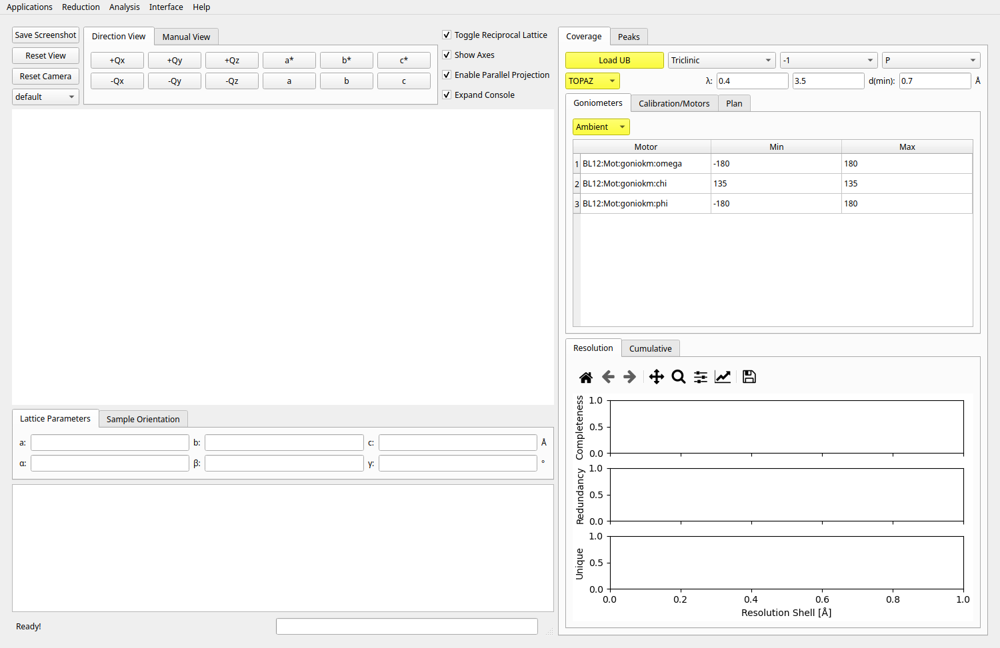
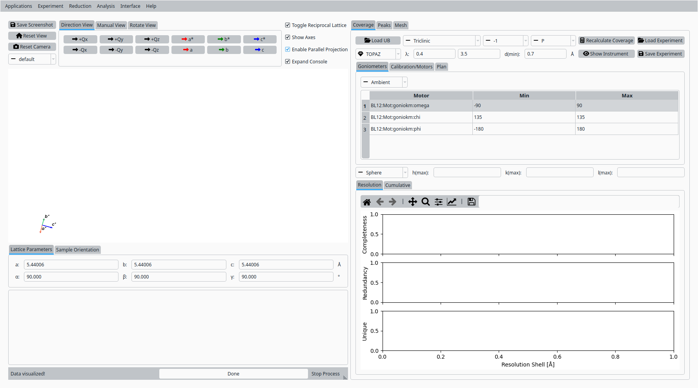
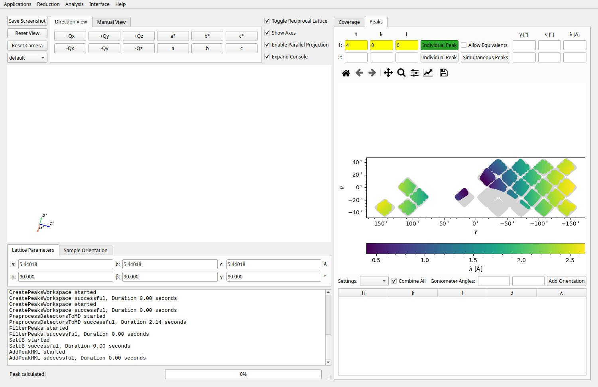
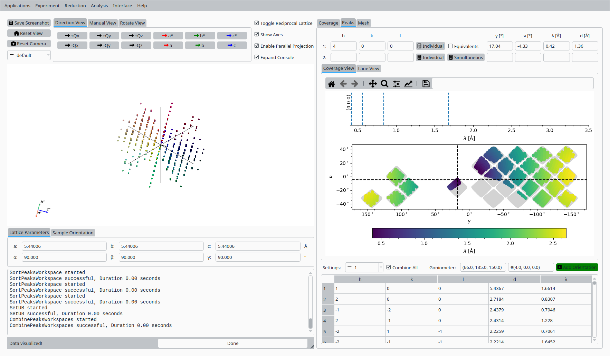
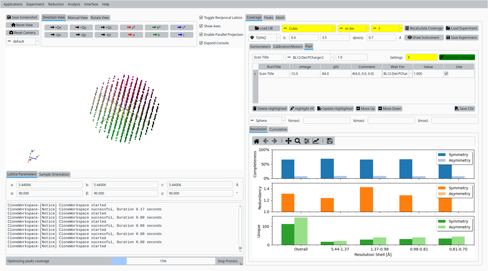
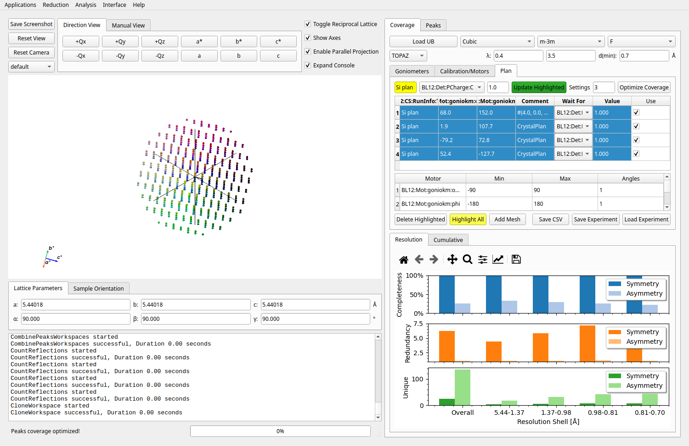
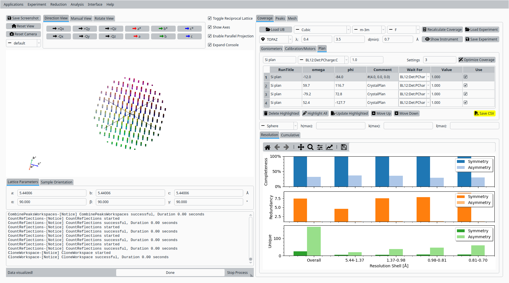

.. _tutorial_topaz_plan:

Experiment Plan with Silicon Data
=================================

This tutorial guides through planning an experiment using the TOPAZ instrument in NeuXtalViz with silicon data.

Step 1: Initialize the Experiment Planner
-----------------------------------------
- Open NeuXtalViz and navigate to the Experiment Planner tab.
- Select "TOPAZ" from the instrument dropdown menu.
- Load the UB matrix and set initial parameters.

   Initial experiment planner setup.

Step 2: Update Goniometer Angles
--------------------------------
- Select the goniometer row and set min/max values (e.g., -90 to 90).

   Update goniometer angles.

Step 3: Calculate Peaks
-----------------------
- Enter orientation parameters and calculate desired peaks.

   Calculate peaks table.

Step 4: Add Orientation
-----------------------
- Add the calculated orientation to the plan.

   Add orientation dialog.

Step 5: Optimize Coverage
-------------------------
- Set crystal system, point group, and centering, then optimize coverage.

   Optimize coverage results.

Step 6: Update and Review
-------------------------
- Highlight and update orientations, review info panel for summary.

   Info panel for experiment summary.

Step 7: Save and Export
-----------------------
- Save the experiment plan as a CSV file.

   Save experiment plan as CSV.
