UB Tools with Natrolite Data
============================

This tutorial demonstrates how to use the UB tools in *NeuXtalViz* to
process CORELLI Natrolite data (chemical formula
:math:`\mathrm{Na_2Al_2Si_3O_{10}\cdot 2H_2O}`).

Step 1: Convert to Q
--------------------

In the **Convert to Q** tab:

- Set the instrument to **CORELLI**.
- Enter the IPTS and run numbers for the Natrolite dataset.
- Set the wavelength range and select the appropriate calibration file.
- Click **Convert to Q** to load the data and build the Q volume.

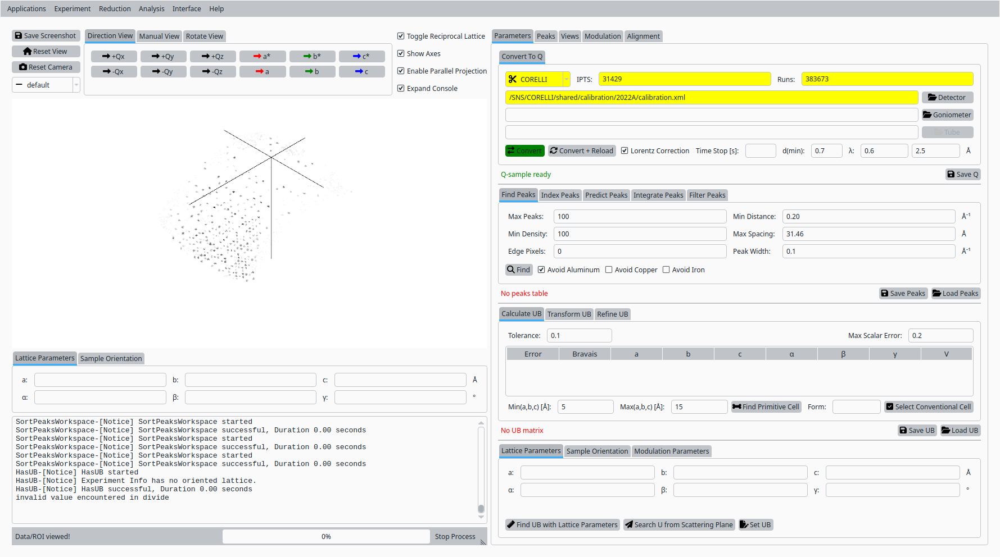

   Convert Natrolite data to Q for CORELLI.

Step 2: Add reference peaks
---------------------------

In the **Inspect / Verify** tab:

- Use the horizontal, vertical, and diffraction controls to define a
  region of interest in the detector view.
- Set the coordinates for the first reference reflection and click
  **Add Peak** to record it.

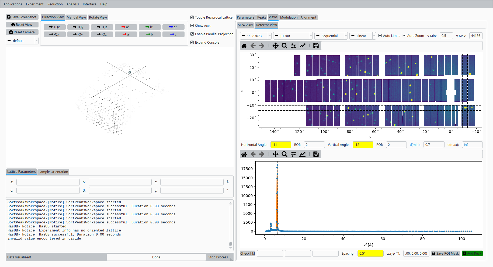

   First reference peak for Natrolite on CORELLI.

- Adjust the ROI and diffraction coordinate for a second reflection
  and click **Add Peak** again.

   Second reference peak for Natrolite on CORELLI.

Step 3: Set initial UB from unit cell
-------------------------------------

Back in the **UB** tools interface:

- Enter approximate lattice parameters for Natrolite (a, b, c and
  angles :math:`\alpha`, :math:`\beta`, :math:`\gamma`).
- Click **Set UB** to construct an initial UB matrix from these
  lattice parameters and the reference peaks.

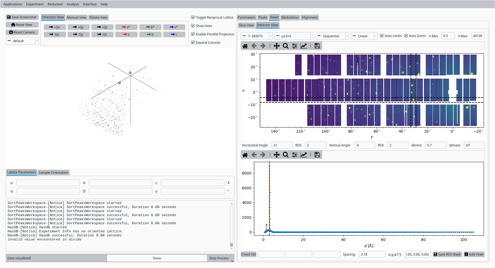

   Initial UB matrix based on the Natrolite unit cell.

Step 4: Hand index reference peaks
----------------------------------

In the **Peaks** tab:

- Select the first reference peak in the table.
- Enter its expected (h, k, l) values in the hand-indexing fields.
- Use the helper controls to copy the integer indices and calculate
  the predicted peak position.

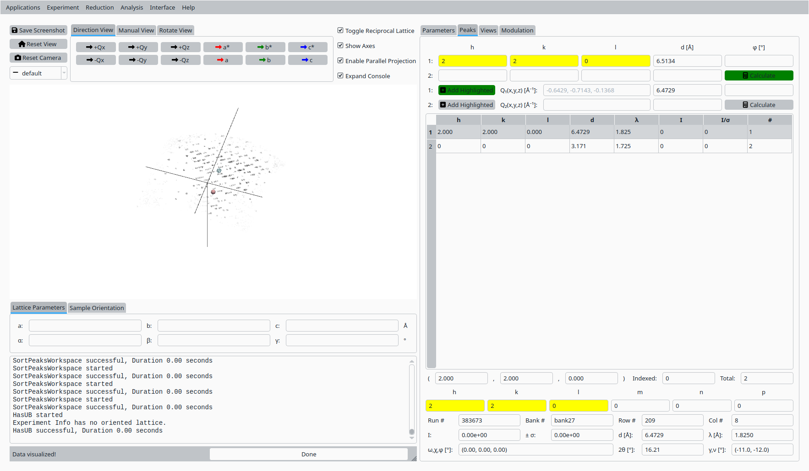

   Hand indexing the first Natrolite peak.

- Select the second reference peak and repeat the hand-indexing
  procedure for its (h, k, l) values.

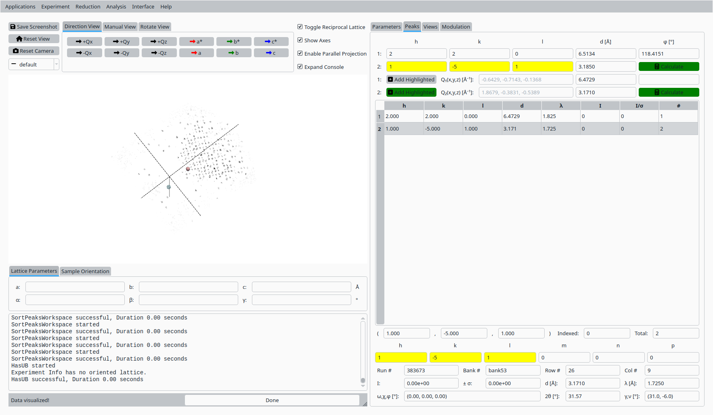

   Hand indexing the second Natrolite peak.

Step 5: Refine UB matrix (constrained)
--------------------------------------

Back in the **UB** tab:

- Choose an optimization mode such as **Constrained** that reflects
  the expected symmetry.
- Click **Refine UB** to refine the UB matrix using the indexed
  reference peaks.

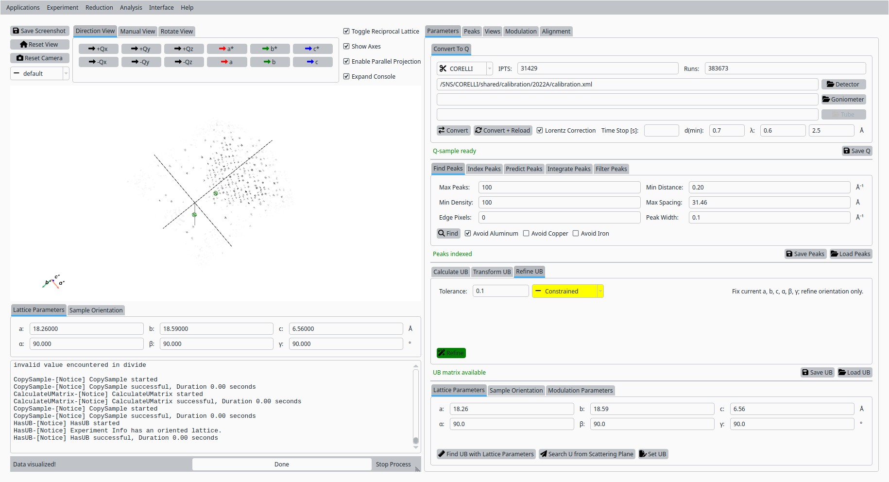

   Refined UB matrix for Natrolite on CORELLI (constrained).

Step 6: Index peaks
-------------------

In the **Peaks** tab:

- Switch to the indexing sub-tab if needed.
- Click **Index Peaks** to apply the refined UB matrix to the peak
  list and assign Miller indices.

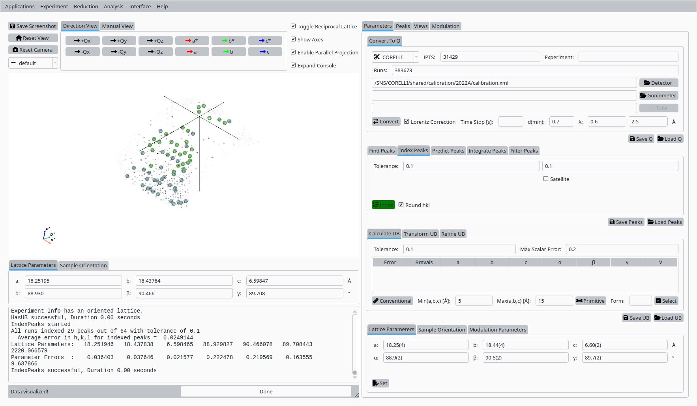

   Automatic indexing of Natrolite peaks.

Step 7: Predict, integrate, and filter peaks
--------------------------------------------

In the **Analyze Peaks** workflow:

- Use the **Predict Peaks** controls to propose additional peaks
  based on the current UB matrix and centering.

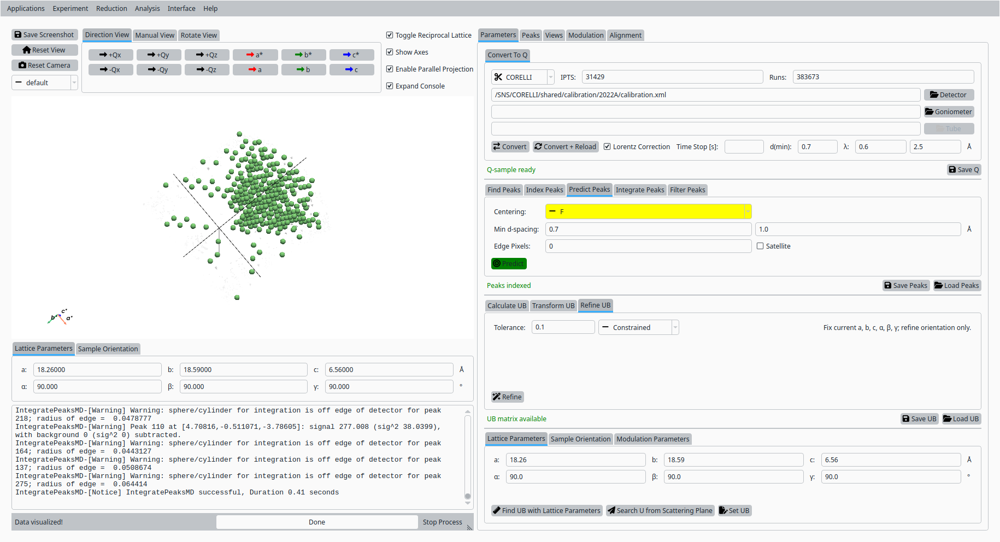

   Predicted Natrolite peaks based on the refined UB.

- Enable adaptive and centroid options as needed and click
  **Integrate Peaks** to integrate the predicted peaks.

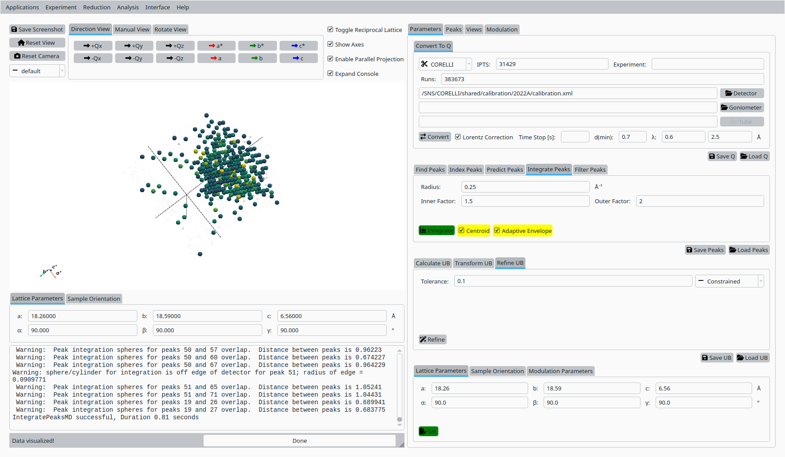

   Integrated Natrolite peaks.

- Apply a filter on peak intensity or signal-to-noise using the
  **Filter Peaks** controls to refine the working peak list.

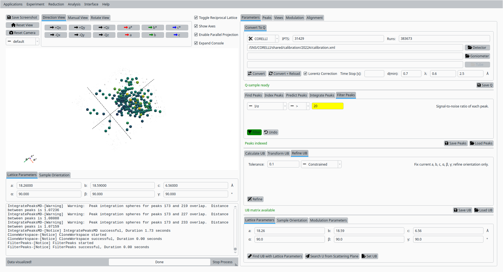

   Filtered Natrolite peak list.

Step 8: Refine UB matrix (orthorhombic)
---------------------------------------

Return to the **UB** tab:

- Change the optimization mode to **Orthorhombic** (or another
  appropriate symmetry).
- Click **Refine UB** again to update the UB matrix using the
  filtered, integrated peaks.

.. figure:: Si_UB_refine_UB.png
   :width: 100%
   :align: center

   Final UB refinement for Natrolite on CORELLI.

Step 9: View indexed peaks
--------------------------

In the **Peaks** tab:

- Select a peak from the table to highlight it in the Q-space view.
- Inspect the indexing, Q position, and fit quality for the
  selected reflection.

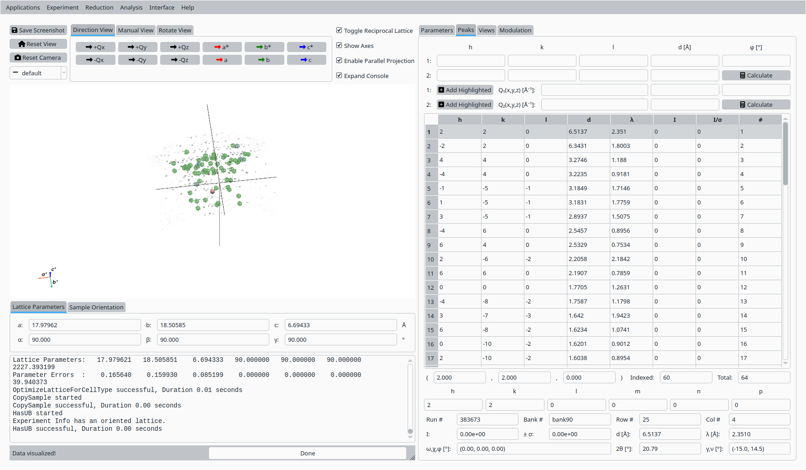

   View and inspect an indexed Natrolite peak.

Step 10: Slice view
-------------------

In the **Convert to HKL** tab:

- Choose a slice direction and coordinate.
- Click **Convert to HKL** to generate a reciprocal-space slice
  based on the refined UB matrix.

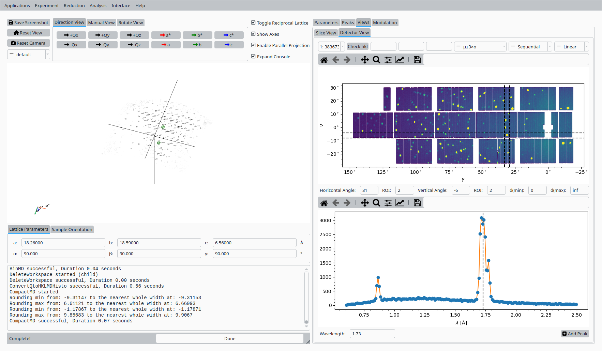

   HKL slice view for the refined Natrolite UB.

Step 11: Save UB
----------------

Back in the **Convert to Q** tab:

- Click **Save UB** to write the refined UB matrix to disk for use in
  subsequent CORELLI Natrolite analysis.

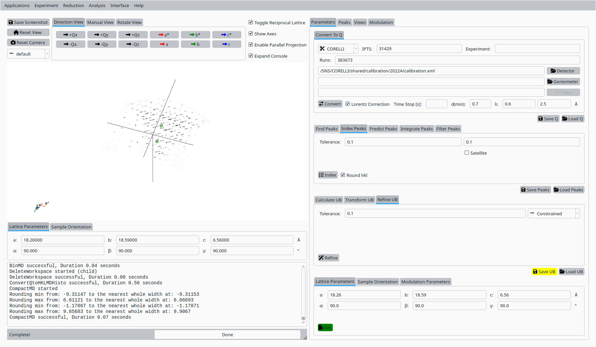

   Save the refined UB matrix for Natrolite.
