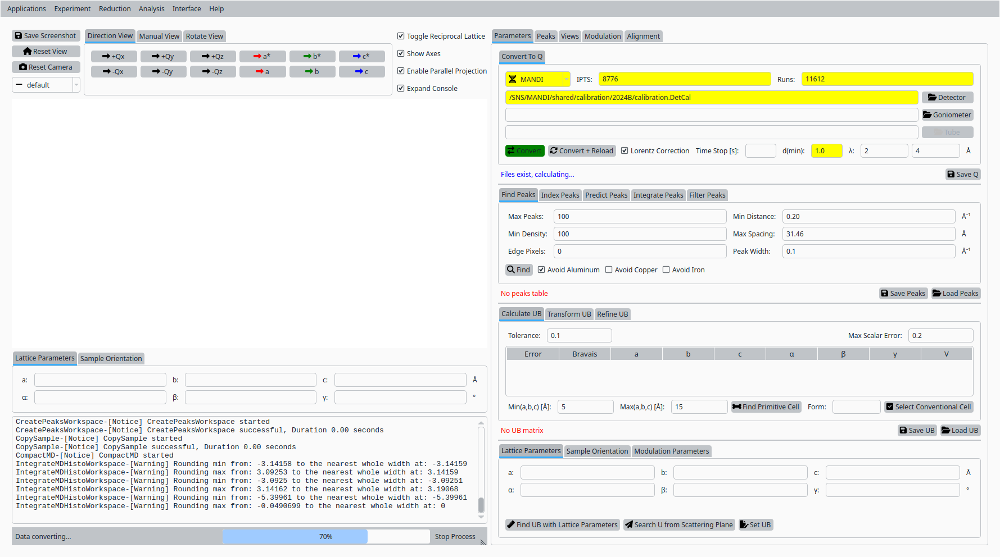
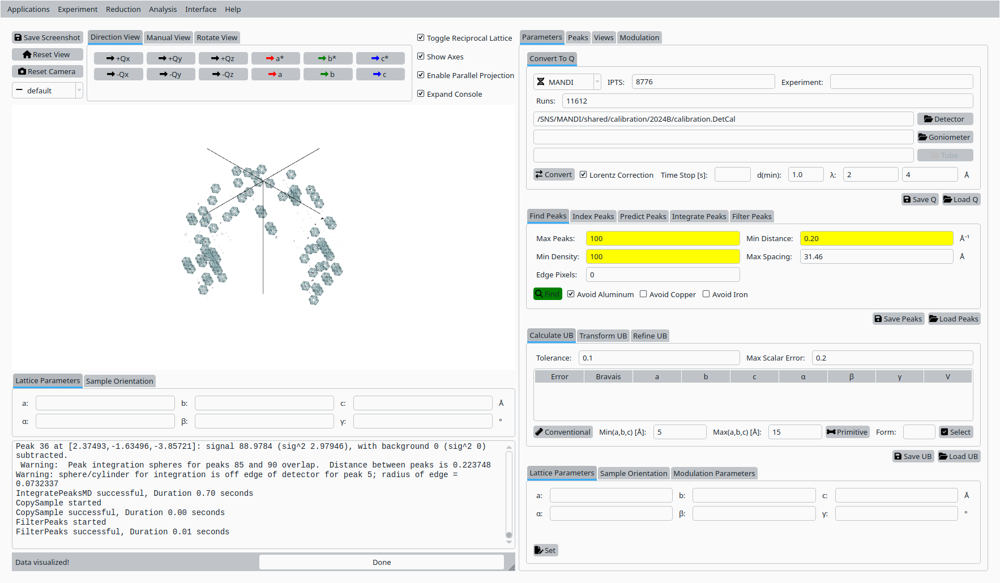
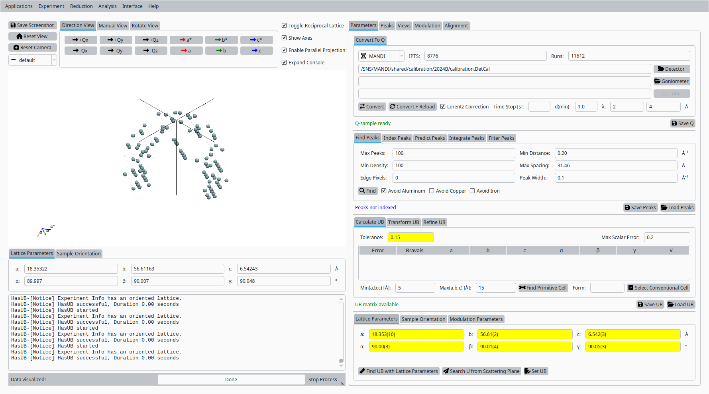
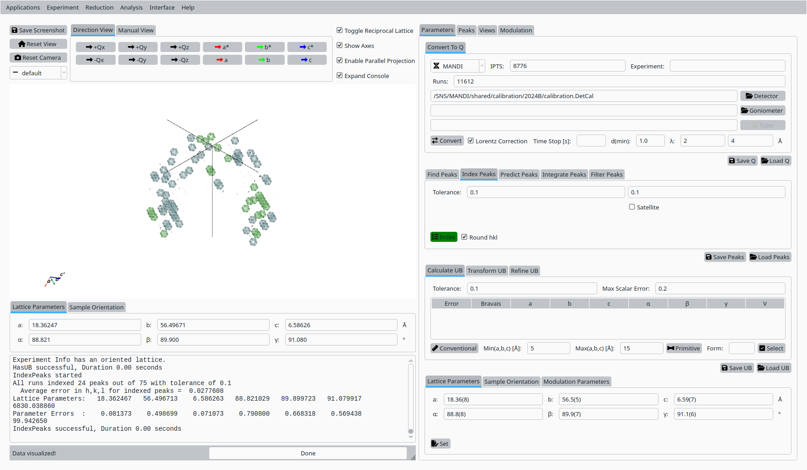
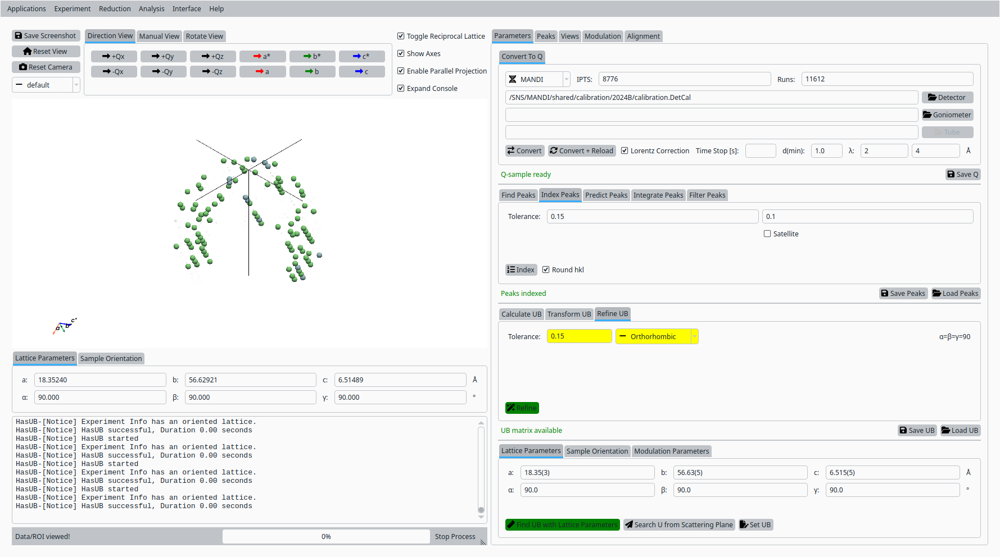
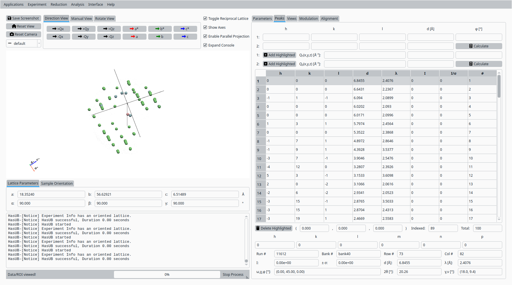
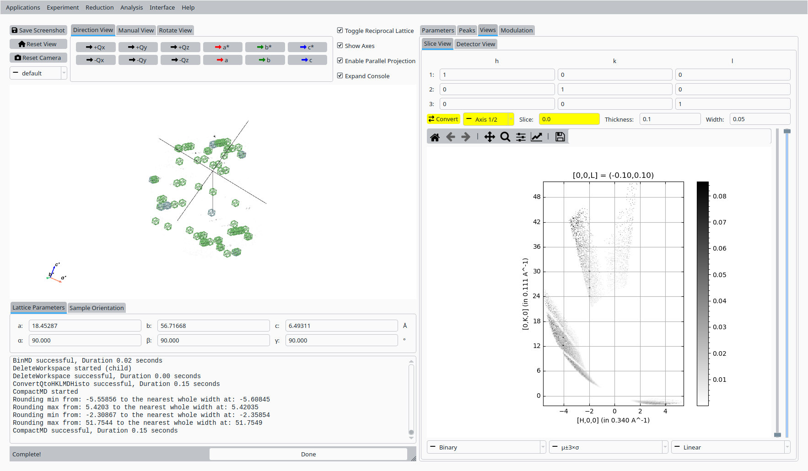
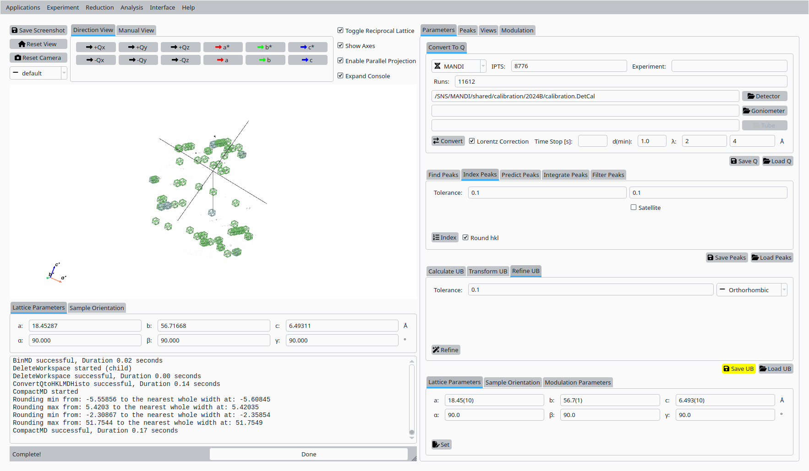

UB Tools with Mesolite Data
===========================

This tutorial demonstrates how to use the UB tools in *NeuXtalViz* to
process MANDI Mesolite data.

Step 1: Convert to Q
---------------------

In the **Convert to Q** tab:

- Select the **MANDI** instrument.
- Enter the IPTS and run numbers for the Mesolite dataset.
- Set the minimum d-spacing and wavelength range as appropriate.
- Provide the MANDI calibration file if needed.
- Click **Convert to Q** to load the data and build the Q volume.

   Convert Mesolite data to Q for MANDI.

Step 2: Find peaks
------------------

Still in the **Convert to Q** tab:

- Adjust the peak-finding parameters (maximum number of peaks,
  density threshold, minimum distance).
- Click **Find Peaks** to locate Bragg peaks in the Q volume.

   Find Bragg peaks in the Mesolite Q volume.

Step 3: Conventional cell
-------------------------

In the **UB** tab:

- Enter approximate lattice parameters for Mesolite.
- Click **Conventional Cell** (or the corresponding button) to
  set up the initial unit cell based on these values.

   Conventional cell for Mesolite on MANDI.

Step 4: Index peaks
-------------------

In the **Peaks** tab:

- Switch to the indexing sub-tab.
- Click **Index Peaks** to index the peak list using the current UB
  and cell parameters.

   Indexing Mesolite peaks on MANDI.

Step 5: Refine UB matrix
------------------------

Back in the **UB** tab:

- Choose an optimization mode (for example, Orthorhombic).
- Click **Refine UB** to refine the UB matrix against the indexed peaks.

   Refined UB matrix for Mesolite.

Step 6: View indexed peaks
--------------------------

In the **Peaks** tab:

- Select a peak in the table to highlight it in the Q-space view.
- Inspect the indexing and fit quality.

   View and inspect an indexed peak for Mesolite.

Step 7: HKL slice view
----------------------

In the **Convert to HKL** tab:

- Choose a slice direction and coordinate.
- Click **Convert to HKL** to generate a reciprocal-space slice.

   HKL slice view for the refined UB.

Step 8: Save UB
----------------

Back in the **Convert to Q** tab:

- Click **Save UB** to write the refined UB matrix to disk for use in
  subsequent analysis.

   Save the refined UB matrix for Mesolite.
