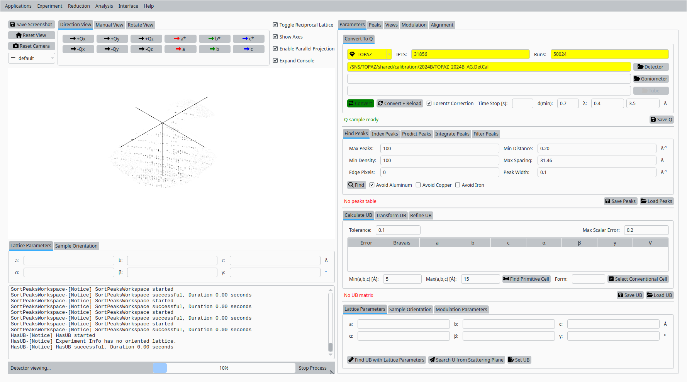
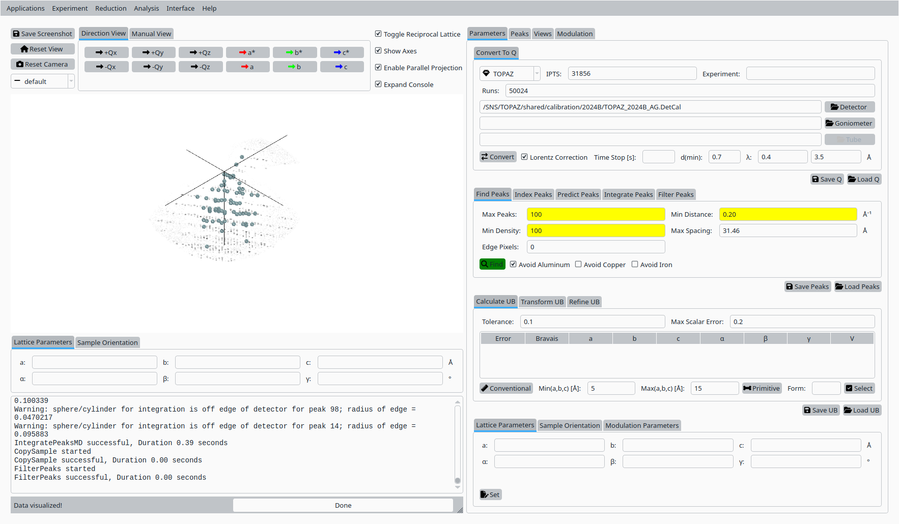
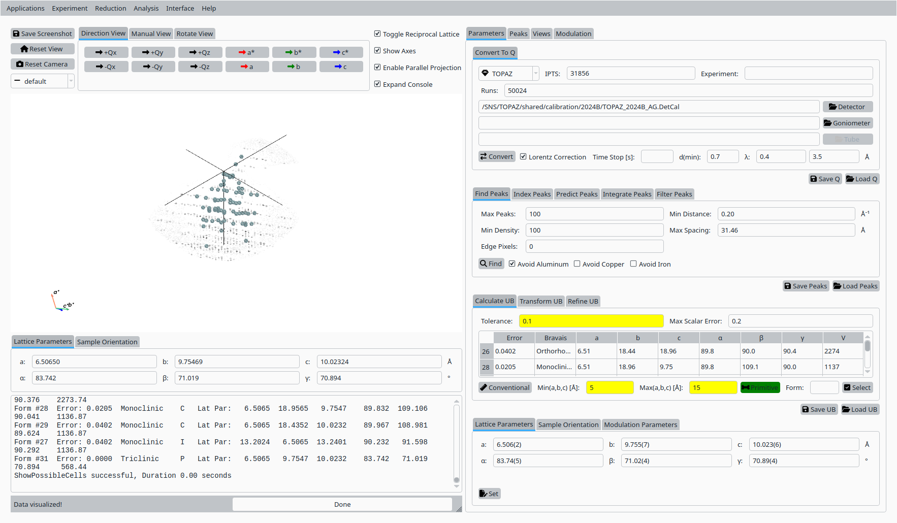
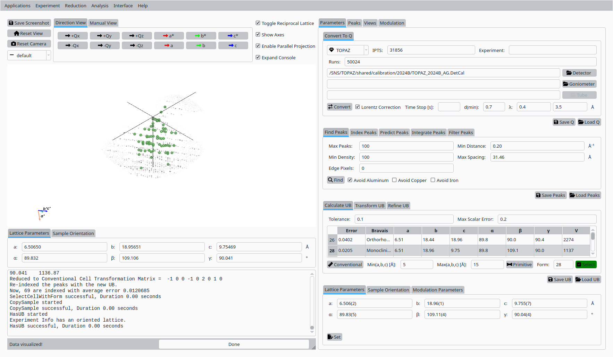
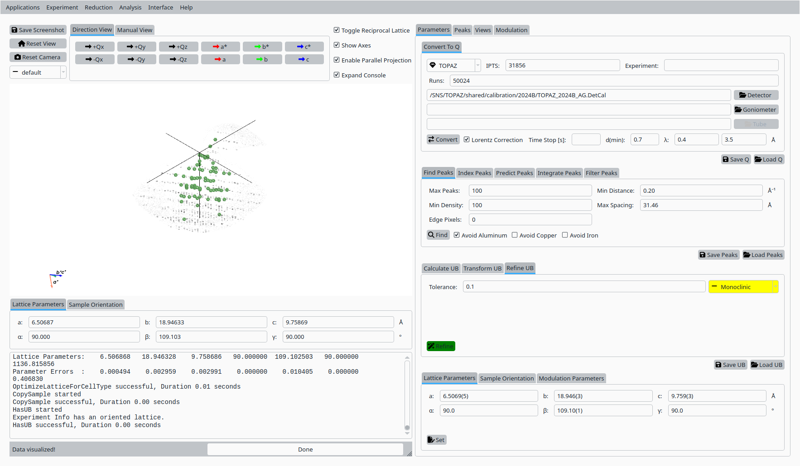
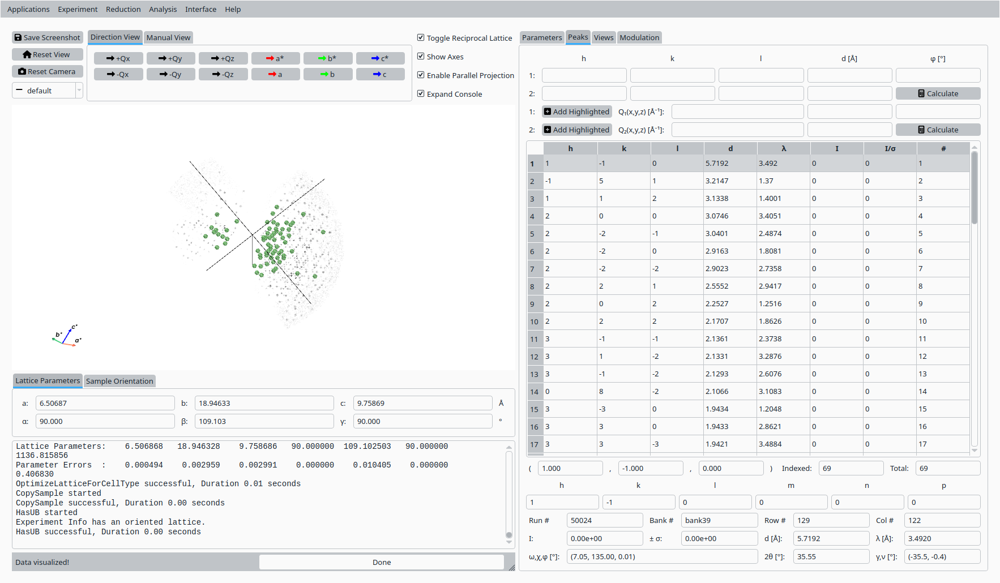
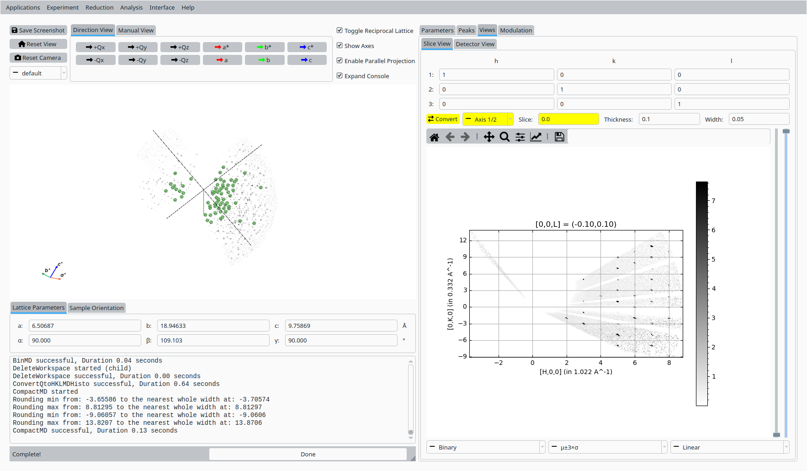
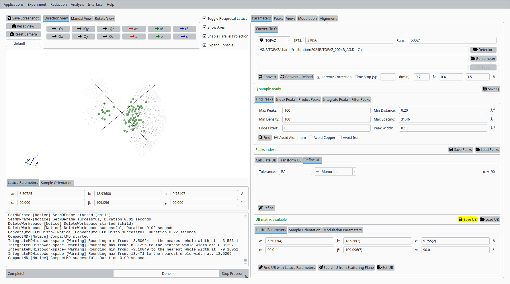

UB Tools with Scolecite Data
============================

This tutorial demonstrates how to use the UB tools in *NeuXtalViz* to
process TOPAZ Scolecite data (chemical formula
:math:`\mathrm{CaAl_2Si_3O_{10}\cdot 3H_2O}`).

Step 1: Convert to Q
---------------------

In the **Convert to Q** tab:

- Select the **TOPAZ** instrument.
- Enter the IPTS number and run numbers for the Scolecite dataset (``IPTS``: ``31856``, runs: ``50024``).
- (Optionally) set wavelength and calibration options as needed.
- Click **Convert to Q** to load the data and build the Q volume.

   Convert Scolecite data to Q for TOPAZ.

Step 2: Find peaks
------------------

Still in the **Convert to Q** tab:

- Adjust the peak-finding parameters (maximum number of peaks,
  density threshold, minimum distance).
- Click **Find Peaks** to locate Bragg peaks in the Q volume.

   Find Bragg peaks in the Scolecite Q volume.

Step 3: Primitive cell
----------------------

In the **UB** tab:

- Set tolerances and cell-parameter bounds for the Niggli reduction.
- Click **Primitive Cell** (Niggli) to search for a primitive cell
  consistent with the peak list.

   Primitive cell solutions for Scolecite.

Step 4: Conventional cell
-------------------------

From the list of candidate cells:

- Select the row corresponding to the desired conventional cell.
- Click **Select** to adopt it as the working unit cell.

   Select a conventional cell for Scolecite on TOPAZ.

Step 5: Refine UB matrix
------------------------

With the conventional cell selected:

- Choose an optimization mode (for example, Monoclinic).
- Click **Refine UB** to refine the UB matrix against the peak list.

   Refined UB matrix for Scolecite.

Step 6: View indexed peaks
--------------------------

In the **Peaks** tab:

- Select a peak in the table to highlight it in the Q-space view.
- Inspect the indexing and fit quality.

   View and inspect an indexed peak.

Step 7: HKL slice view
----------------------

In the **Convert to HKL** tab:

- Choose a slice direction and coordinate.
- Click **Convert to HKL** to generate a reciprocal-space slice.

   HKL slice view for the refined UB.

Step 8: Save UB
----------------

Back in the **Convert to Q** tab:

- Click **Save UB** to write the refined UB matrix to disk for use in
  subsequent analysis.

   Save the refined UB matrix for Scolecite.
