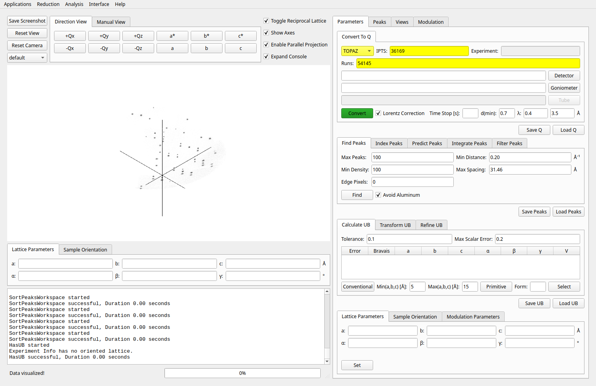
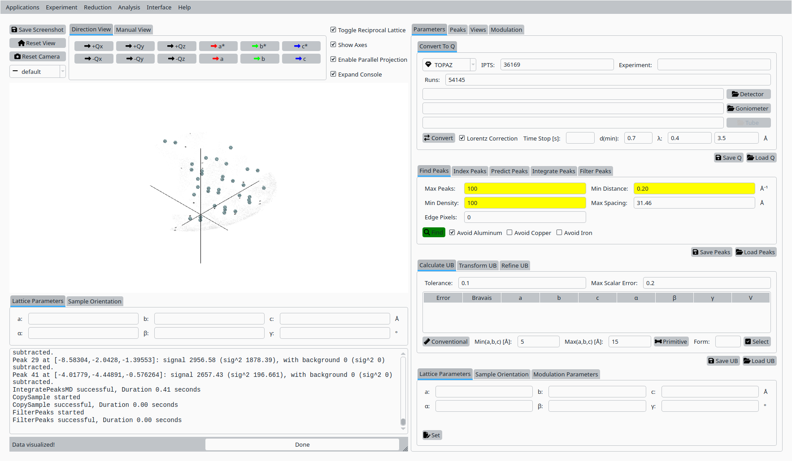
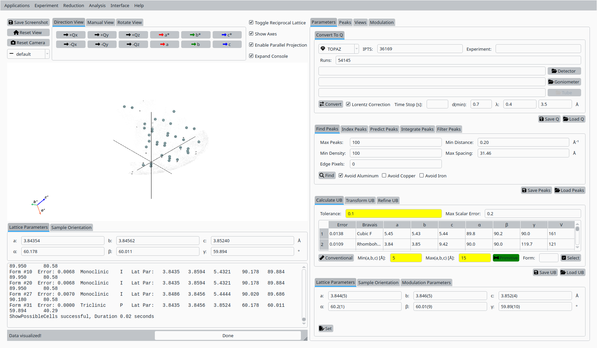
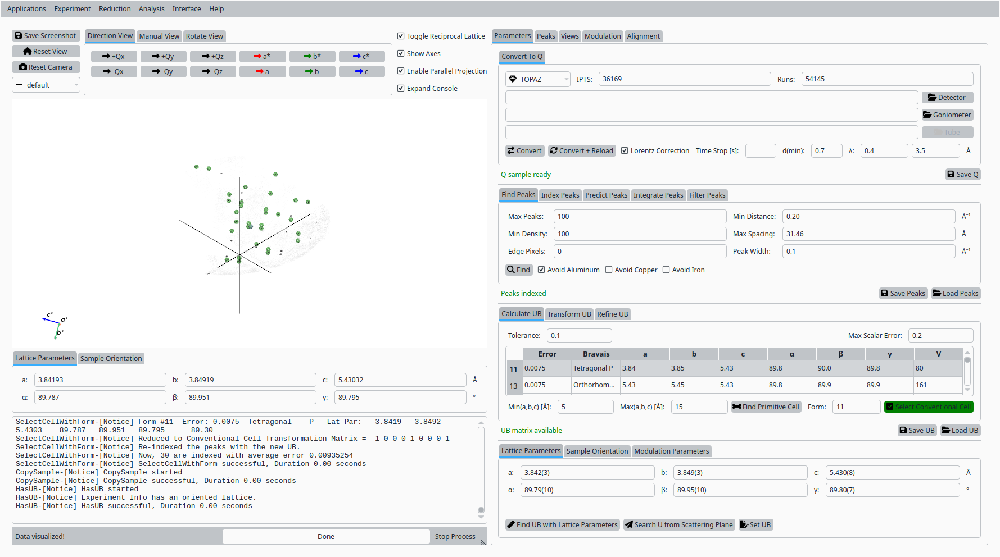
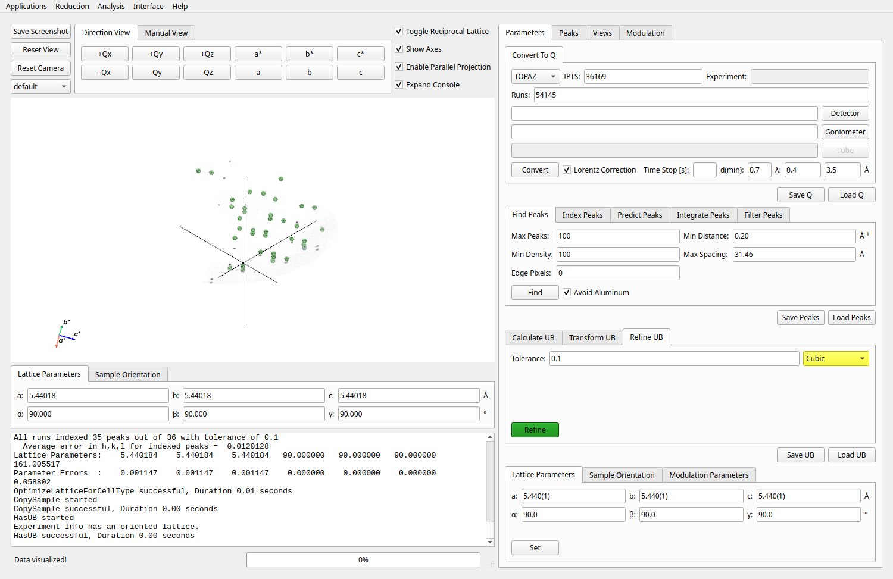
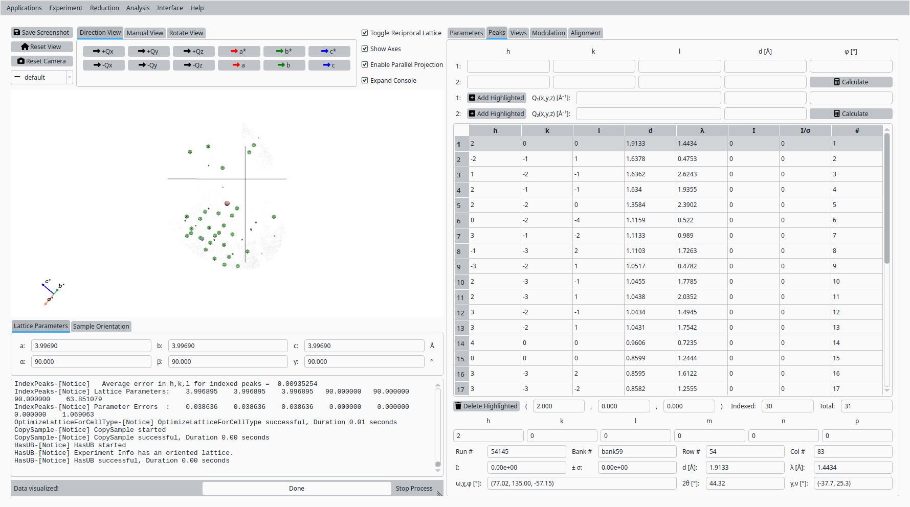
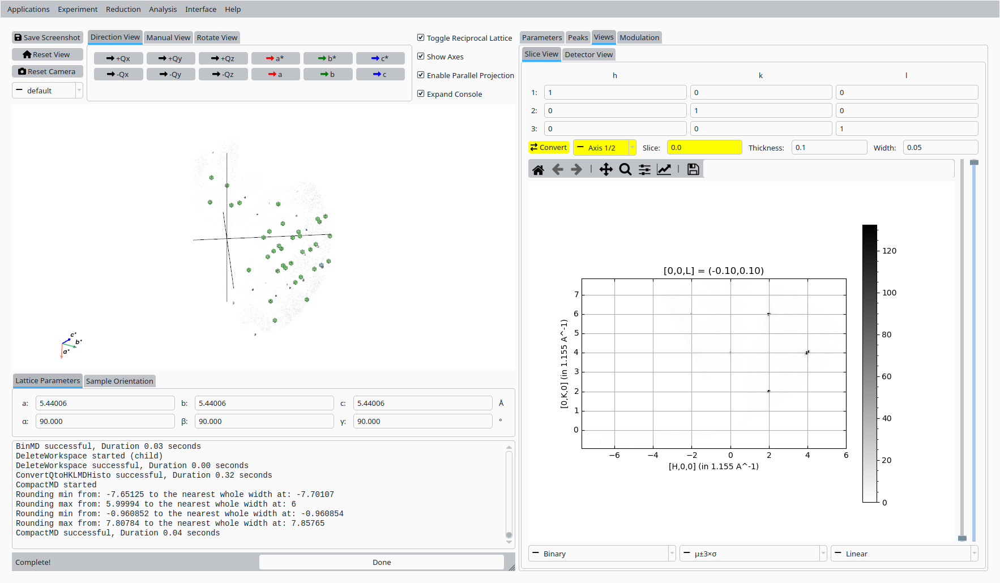
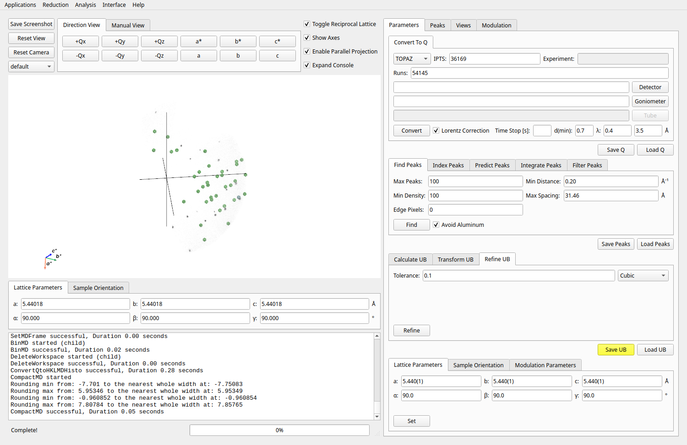

UB Tools with Silicon Data
==========================

This tutorial demonstrates how to use the UB tools in *NeuXtalViz* to process TOPAZ silicon data.

Step 1: Select Instrument and Data
----------------------------------
- Set the instrument to **TOPAZ**.
- Enter IPTS number: ``36169``.
- Enter run number: ``54145``.
- Click **Convert** to load and convert the data.

   Convert to Q workspace.

Step 2: Find Peaks
------------------
- Adjust peak finding parameters as needed:
- Max peaks
- Density threshold
- Min distance
- Click **Find** to identify candidate peaks.

   Find Peaks.

Step 3: Primitive Cell Calculation
----------------------------------
- Set tolerance and constraints for cell finding.
- Click **Primitive** to calculate the primitive cell.

   Primitive Cell Calculation.

Step 4: Select Conventional Cell
-------------------------------
- Select the desired cell from the table.
- Click **Select** to set the conventional cell.

   Select Conventional Cell.

Step 5: Refine UB Matrix
------------------------
- Switch to the UB Refinement tab.
- Set the cell constraint (e.g., **Cubic**).
- Click **Refine** to optimize the UB matrix.

   Refine UB Matrix.

Step 6: View Peak
-----------------
- Switch to the Peaks tab.
- Select a peak from the table to view its details.

   View Peak in Peaks Table.

Step 7: Slice View
------------------
- Switch to the Slice tab.
- Adjust slice parameters and click **Slice** to view the slice in HKL space.

   Slice View in HKL Space.

Step 8: Save UB
---------------
- After refining the UB matrix, click **Save UB** to export the UB matrix and related information.

   Save UB Matrix and Export Results.
