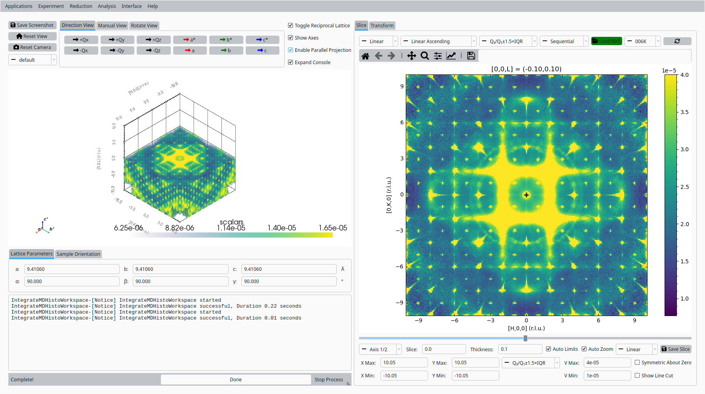
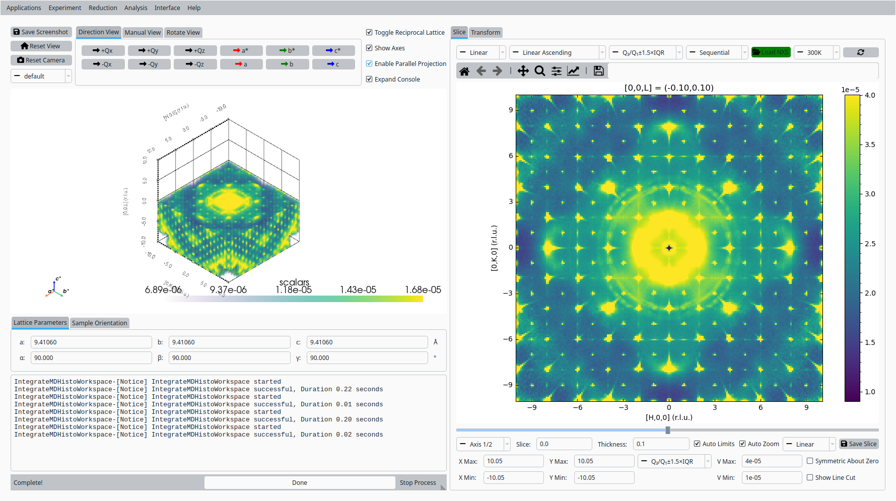
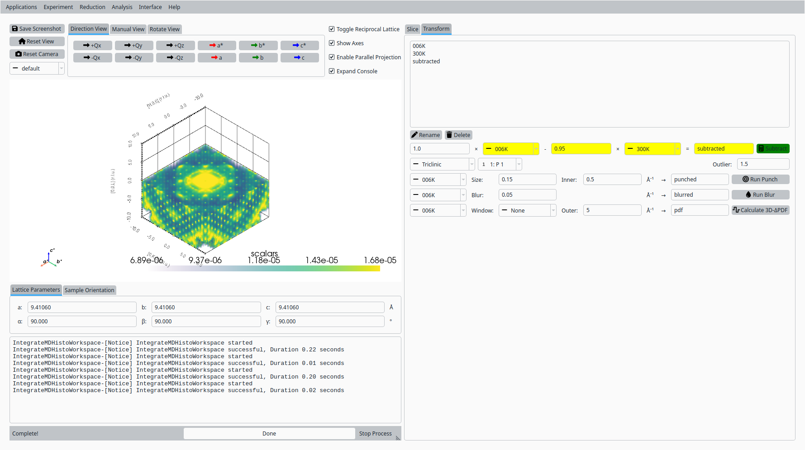
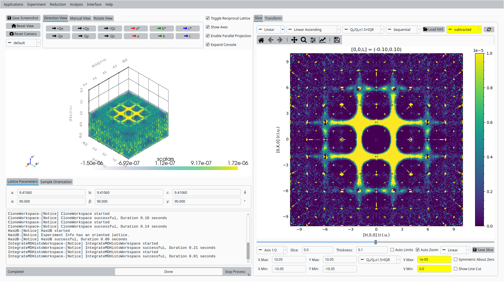
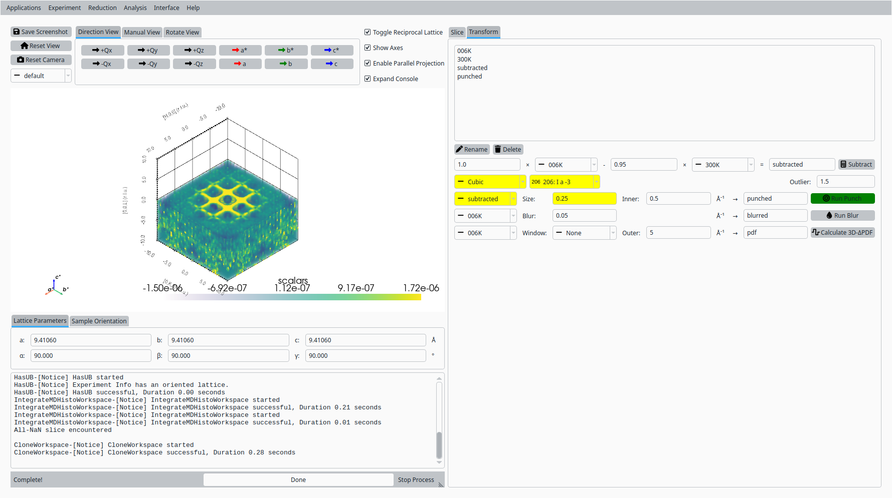
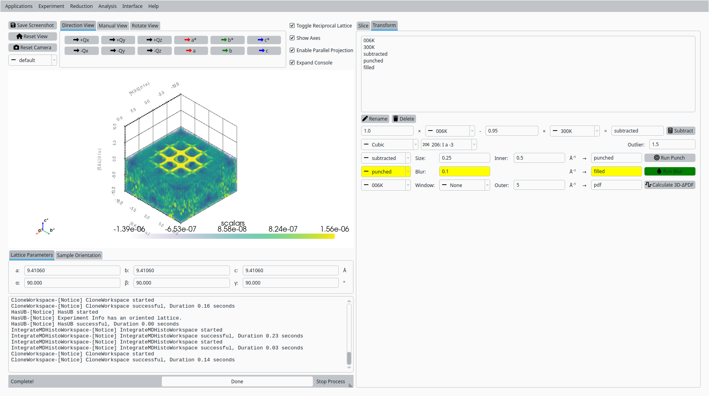
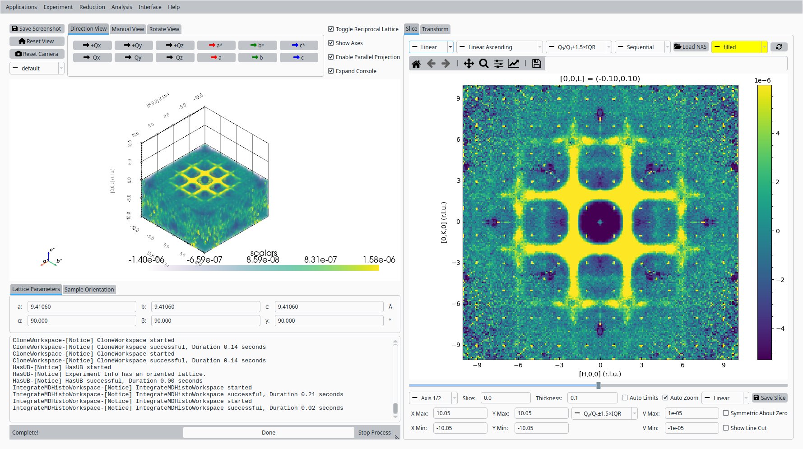
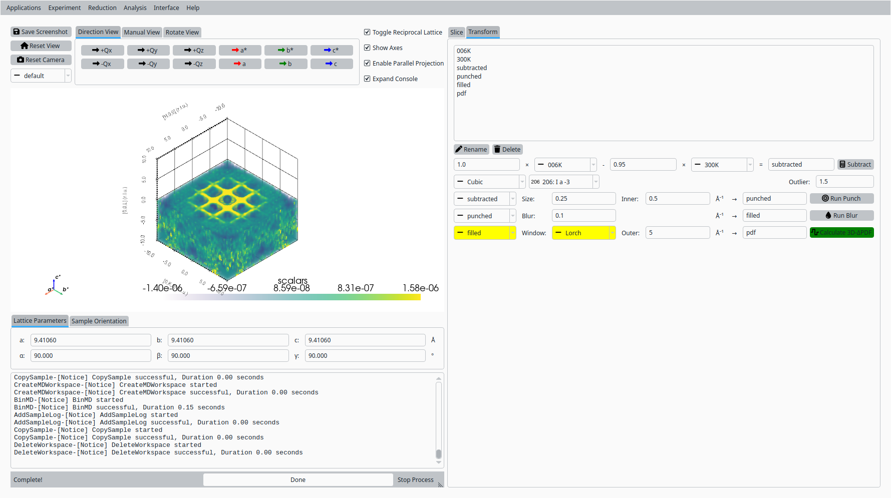
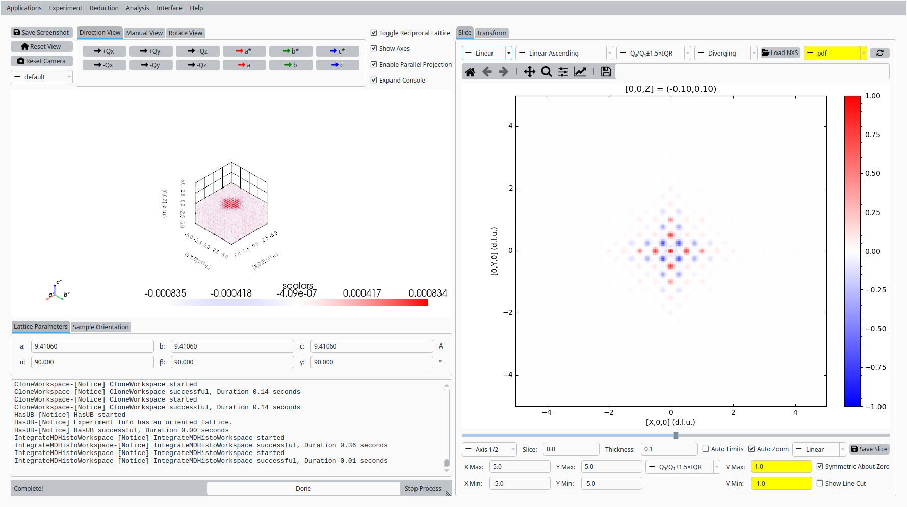

.. _tutorial_corelli_volume_deltapdf:

3D-ΔPDF with Bixbyite Data
==========================

This tutorial demonstrates how to use the volume slicer's Transform tab in NeuXtalViz to calculate a 3D-ΔPDF from normalized CORELLI bixbyite volume data collected at 6 K and 300 K.

Step 1: Load the 6 K Data
--------------------------
- Open NeuXtalViz and navigate to the Volume Slicer tab.
- Load the normalized NeXus file for the 6 K dataset, naming it "006K".

   Load the 6 K bixbyite data.

Step 2: Load the 300 K Data
----------------------------
- Load the normalized NeXus file for the 300 K dataset, naming it "300K".

   Load the 300 K bixbyite data.

Step 3: Subtract the High-Temperature Background
--------------------------------------------------
- Switch to the Transform tab.
- In the arithmetic panel, select "006K" as workspace A and "300K" as workspace B, scaling B by 0.95.
- Name the output "subtracted" and run the subtraction.

   Subtract the scaled 300 K background from the 6 K data.

Step 4: View the Subtracted Data
----------------------------------
- Switch back to the Slice tab.
- Select "subtracted" in the workspace combo.
- Set the color limits to V Min = 0 and V Max = 1e-5.

   View the subtracted reciprocal-space data.

Step 5: Punch the Bragg Peaks
--------------------------------
- Switch back to the Transform tab.
- Select the "Cubic" crystal system and space group 206.
- Select "subtracted" as the input workspace, set the punch size to 0.25 (keeping the default inner radius), and run the punch.

   Punch out the Bragg peaks and low-Q region.

Step 6: View the Punched Data
--------------------------------
- Switch back to the Slice tab.
- Select "punched" in the workspace combo to see the punched-out regions.

   View the punched reciprocal-space data.

Step 7: Fill the Punched Regions
-----------------------------------
- Switch back to the Transform tab.
- Select "punched" as the input workspace, name the output "filled", set the blur size to 0.1, and run the blur.

   Fill the punched regions with a NaN-Gaussian blur.

Step 8: View the Filled Data
-------------------------------
- Switch back to the Slice tab.
- Select "filled" in the workspace combo to see the gaps closed in.

   View the filled reciprocal-space data.

Step 9: Calculate the 3D-ΔPDF
--------------------------------
- Switch back to the Transform tab.
- Select "filled" as the input workspace, choose the "Lorch" apodization window (keeping the default outer Q), and calculate the 3D-ΔPDF.

   Calculate the 3D-ΔPDF.

Step 10: View the 3D-ΔPDF
----------------------------
- Switch back to the Slice tab.
- Select "pdf" in the workspace combo.
- Set the color limits to V Min = -1 and V Max = 1.

   View the resulting 3D-ΔPDF.
