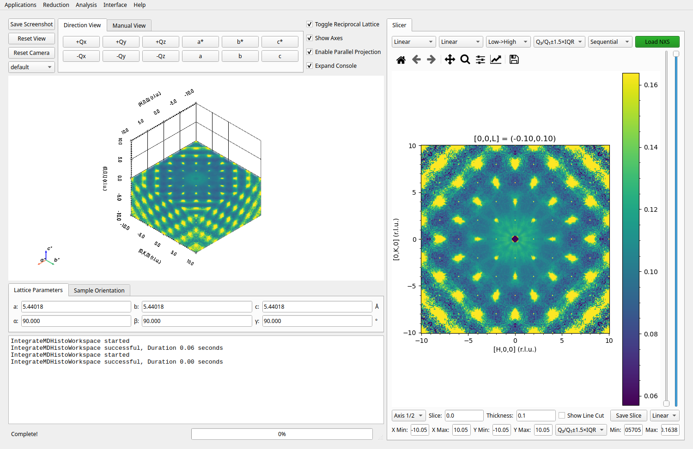
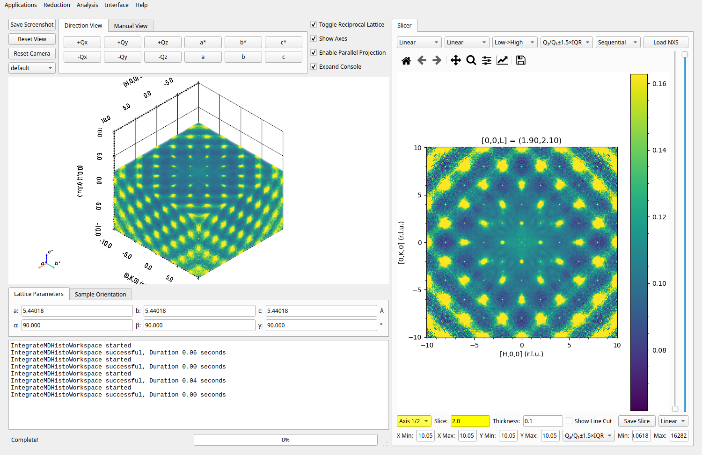
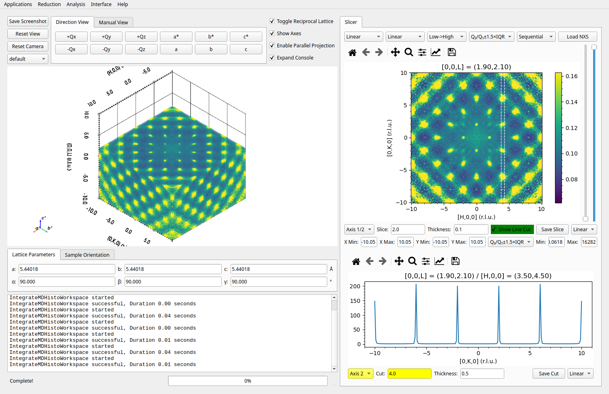
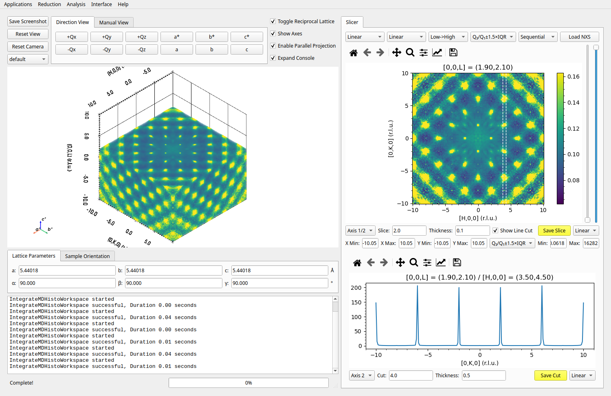

.. _tutorial_topaz_volume:

Volume Slicer with Silicon Data
===============================

This tutorial demonstrates how to use the volume slicer in NeuXtalViz with normalized TOPAZ silicon volume data.

Step 1: Load the Data
---------------------
- Open NeuXtalViz and navigate to the Volume Slicer tab.
- Load the normalized NeXus file for the silicon dataset.

   Load normalized silicon data.

Step 2: Create a Slice
----------------------
- Set the slice value and axis as needed.
- Click to redraw and view the slice.

   Slice through the silicon volume.

Step 3: Make a Cut
------------------
- Select the cut axis and set the cut value.
- Toggle the line box and redraw to view the cut.

   Cut through the silicon volume.

Step 4: Save the Results
------------------------
- Save the current slice and cut using the save buttons.

   Save slice and cut results.
