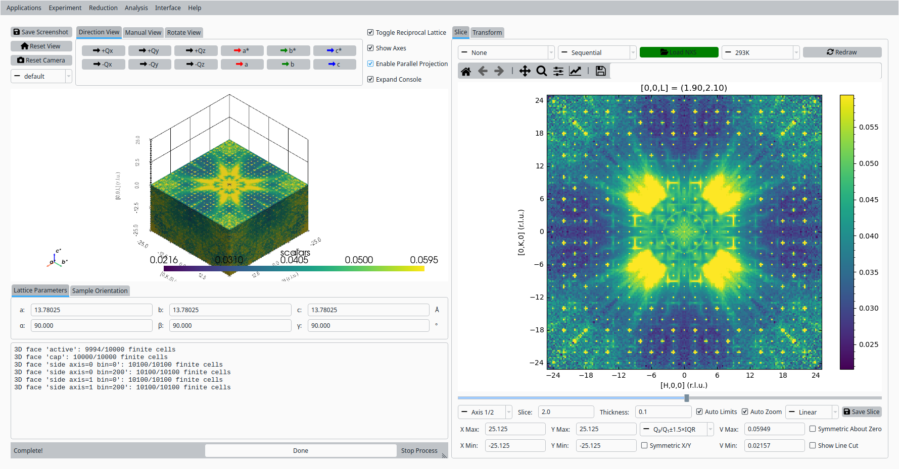
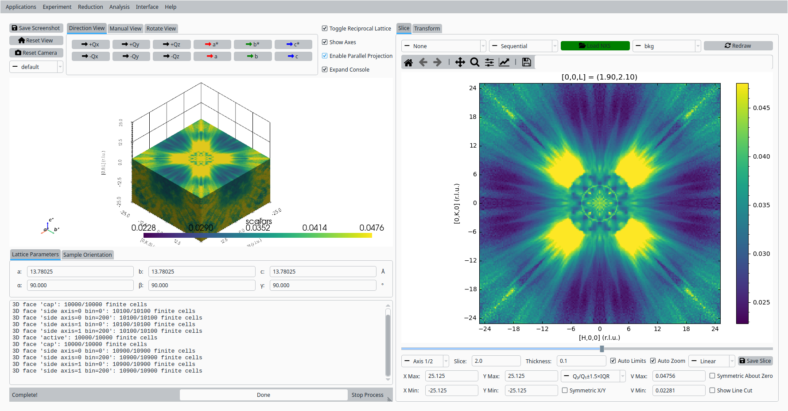
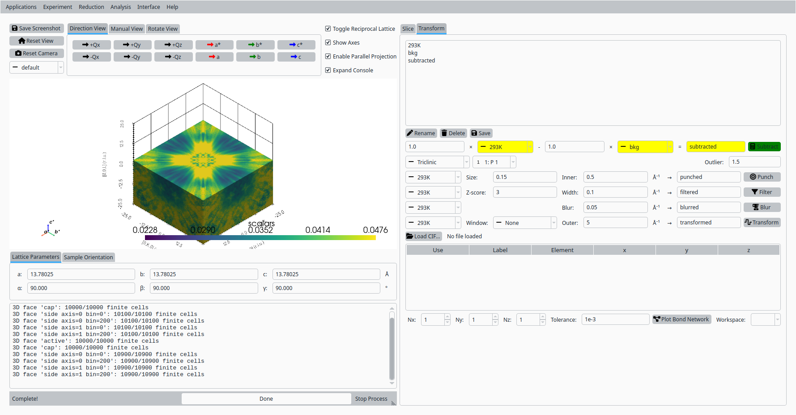
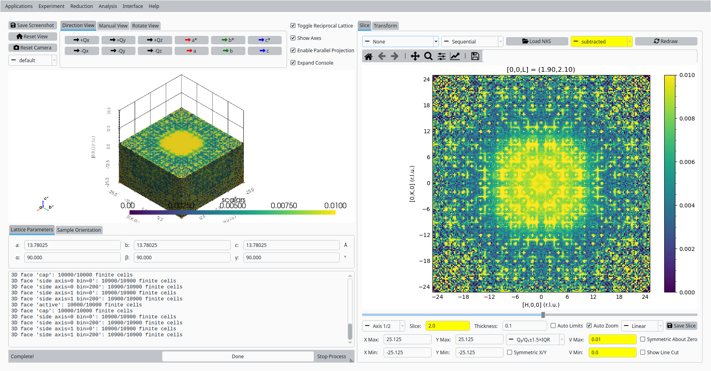
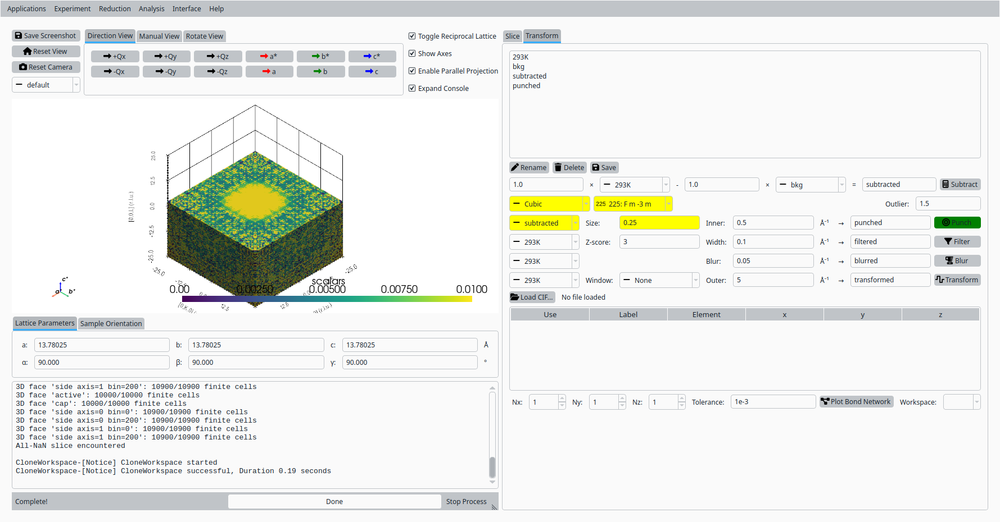
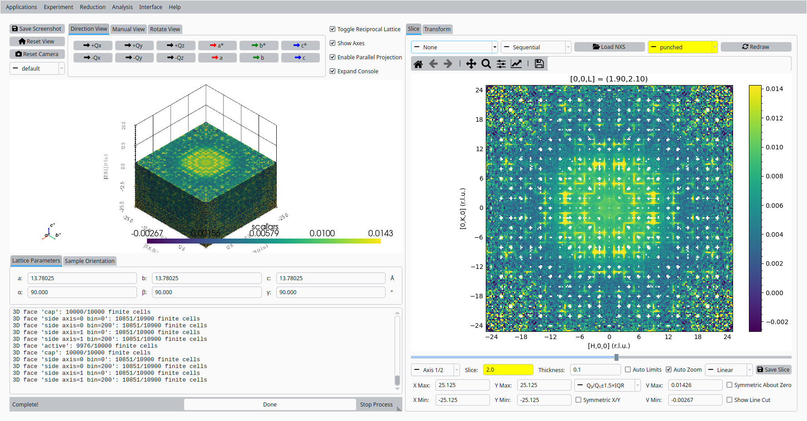
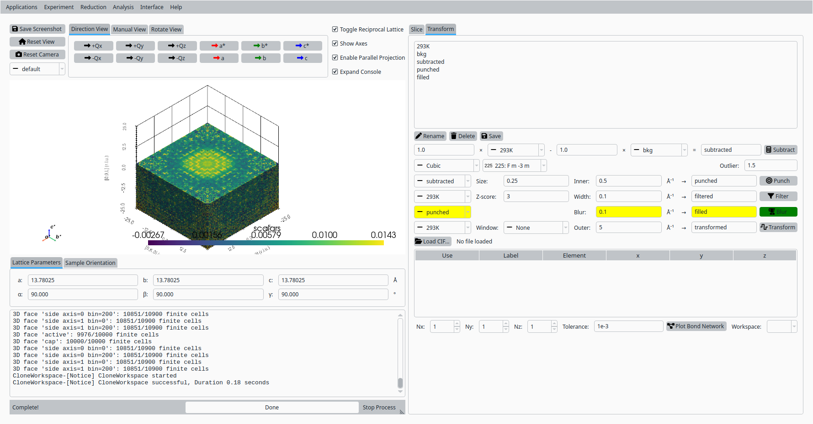
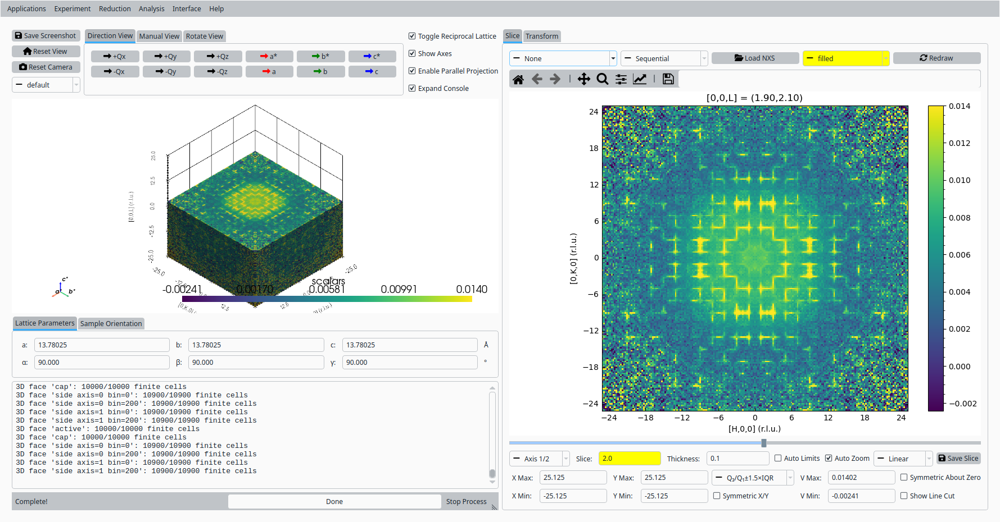
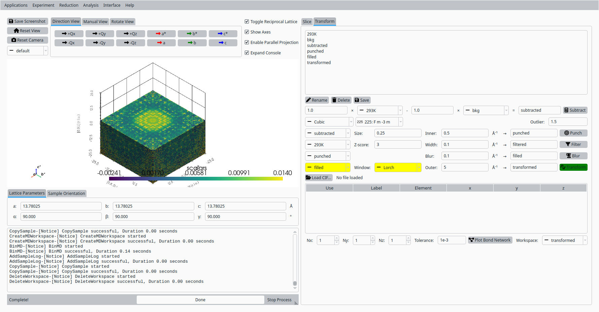
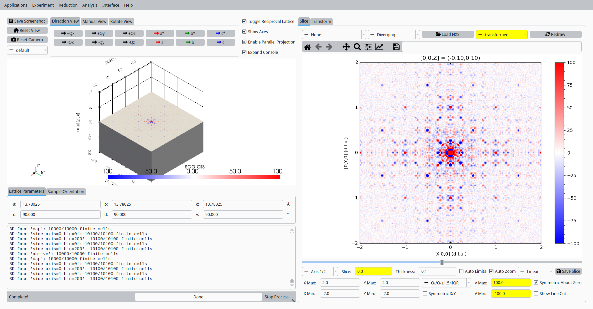

.. _tutorial_topaz_volume_deltapdf:

3D-ΔPDF with Tb5Ru6Sn18 Data
=============================

This tutorial demonstrates how to use the volume slicer's Transform tab in NeuXtalViz to calculate a 3D-ΔPDF from normalized TOPAZ Tb5Ru6Sn18 volume data collected at room temperature (293 K), using a no-sample measurement as the background. The reciprocal-space steps show the (h,k,l=2) slice; the final real-space 3D-ΔPDF shows the (x,y,z=0) slice.

Step 1: Load the Room-Temperature Data
----------------------------------------
- Open NeuXtalViz and navigate to the Volume Slicer tab.
- Load the normalized NeXus file for the 293 K dataset, naming it "293K".
- Set the slice axis value to L = 2.0.

   Load the room-temperature Tb5Ru6Sn18 data at L = 2.

Step 2: Load the No-Sample Background Data
---------------------------------------------
- Load the normalized NeXus file for the no-sample background, naming it "bkg".
- Set the slice axis value to L = 2.0.

   Load the no-sample background data at L = 2.

Step 3: Subtract the No-Sample Background
---------------------------------------------
- Switch to the Transform tab.
- In the arithmetic panel, select "293K" as workspace A and "bkg" as workspace B.
- Name the output "subtracted" and run the subtraction.

   Subtract the no-sample background from the room-temperature data.

Step 4: View the Subtracted Data
------------------------------------
- Switch back to the Slice tab.
- Select "subtracted" in the workspace combo.
- Set the slice axis value to L = 2.0.
- Set the color limits to V Min = 0 and V Max = 1e-2.

   View the subtracted reciprocal-space data at L = 2.

Step 5: Punch the Bragg Peaks
--------------------------------
- Switch back to the Transform tab.
- Select the "Cubic" crystal system and space group 225 (Fm-3m).
- Select "subtracted" as the input workspace, set the punch size to 0.25 (keeping the default inner radius), and run the punch.

   Punch out the Bragg peaks and low-Q region.

Step 6: View the Punched Data
--------------------------------
- Switch back to the Slice tab.
- Select "punched" in the workspace combo to see the punched-out regions at L = 2.

   View the punched reciprocal-space data at L = 2.

Step 7: Fill the Punched Regions
-----------------------------------
- Switch back to the Transform tab.
- Select "punched" as the input workspace, name the output "filled", set the blur size to 0.1, and run the blur.

   Fill the punched regions with a NaN-Gaussian blur.

Step 8: View the Filled Data
-------------------------------
- Switch back to the Slice tab.
- Select "filled" in the workspace combo to see the gaps closed in at L = 2.

   View the filled reciprocal-space data at L = 2.

Step 9: Calculate the 3D-ΔPDF
--------------------------------
- Switch back to the Transform tab.
- Select "filled" as the input workspace, choose the "Lorch" apodization window (keeping the default outer Q), and calculate the 3D-ΔPDF.

   Calculate the 3D-ΔPDF.

Step 10: View the 3D-ΔPDF
----------------------------
- Switch back to the Slice tab.
- Select "transformed" in the workspace combo.
- Set the slice axis value to Z = 0.0 (the transformed result is real-space).
- Set the color limits to V Min = -100 and V Max = 100.

   View the resulting 3D-ΔPDF at Z = 0.
